# Operator Manual · v1.3.0-sprint2-complete

> **Release:** `v1.3.0-sprint2-complete` (Strategy Factory Operator OS)
> **Prepared:** 2026-07-21
> **Predecessor manual:** `docs/legacy/memory/OPERATOR_MANUAL.md` (Phase-1 audit · v1.1 canonical shell)
> **Freeze status at ship:** Backend Feature Freeze `v1.1.0-stage4` · Design Freeze `v1.0` — both preserved end-to-end.
> **Audience:** The single human operator who runs the AI Strategy Factory day-to-day.
>
> This manual answers **"as the operator, what can I do today, and where do I do it?"** It is a navigational and procedural guide, not an architecture document. Every screenshot in this manual is captured directly from the shipping build (see `memory/manual-assets/screenshots/`).

---

## Table of contents

0. [What changed since v1.1 — read this first](#0--whats-new-in-v130)
1. [The Command Shell at a glance](#1--the-command-shell-at-a-glance)
2. [Signing in](#2--signing-in)
3. [Mission Control · `/c/mission`](#3--mission-control--cmission)
4. [Master Bot · `/c/masterbot`](#4--master-bot--cmasterbot) *(new in Sprint 2)*
5. [Timeline · `/c/timeline`](#5--timeline--ctimeline)
6. [Approvals · `/c/approvals`](#6--approvals--capprovals)
7. [Workforce · `/c/workforce`](#7--workforce--cworkforce)
8. [Strategies · `/c/strategies`](#8--strategies--cstrategies)
9. [Strategy Passport · `/c/strategies/:id`](#9--strategy-passport--cstrategiesid) *(new in Sprint 2)*
10. [Settings · `/c/settings`](#10--settings--csettings)
11. [The `⌘K` command palette](#11--the-k-command-palette)
12. [Mode · Lens · Density (personalization)](#12--mode--lens--density-personalization)
13. [The Status Rail & streaming affordances](#13--the-status-rail--streaming-affordances)
14. [Workflows an operator will actually run](#14--workflows-an-operator-will-actually-run)
15. [Freeze posture & backend advisory mode](#15--freeze-posture--backend-advisory-mode)
16. [Emergency posture](#16--emergency-posture)
17. [Troubleshooting](#17--troubleshooting)
18. [Appendix A · Route inventory](#appendix-a--route-inventory)
19. [Appendix B · Data-testid map for QA / automation](#appendix-b--data-testid-map-for-qa--automation)
20. [Appendix C · Fixture credentials](#appendix-c--fixture-credentials)

---

## 0 · What's new in v1.3.0

Sprint 2 shipped **frontend-only, additive, adapter-boundary-preserving** changes on top of the `v1.2.0-sprint1-complete` shell. Zero backend commits. Zero design-token edits. Every legacy capability from the v0.1 factory is either exposed on a first-class surface, re-routed through Master Bot / Approvals / Passport, or intentionally moved into the Advanced Lens.

| Δ since `v1.2.0-sprint1-complete` | Surface / affordance | Where |
|---|---|---|
| **New signature surface** | Master Bot Dashboard (D4) | [`/c/masterbot`](#4--master-bot--cmasterbot) |
| **New gallery surface** | Strategy Passport (D5) | [`/c/strategies/:id`](#9--strategy-passport--cstrategiesid) |
| **Streaming affordances** | `StreamPostmark` on Timeline · Approvals · StatusRail (WSS + poll fallback) | [§13](#13--the-status-rail--streaming-affordances) |
| **Palette expansion (R3)** | `Propose new strategy…` · `Optimize strategy…` · `Promote to live…` | [§11](#11--the-k-command-palette) |
| **Mission Control (R1)** | `Portfolio Equity` metric block restored to the 4-strip | [§3](#3--mission-control--cmission) |
| **Master Bot plan card (R2)** | `Discovery cycle · next-tick postmark` | [§4](#4--master-bot--cmasterbot) |
| **Focus trap & auth handling (N4)** | ⌘K focus-trap · 401 interceptor with graceful re-auth · `sf-auth-unauthorized` event · `REACT_APP_STRICT_LIVE` flag | Silent |
| **Legacy purge (N4)** | `.archive/v01/` — v01 shell components fully retired | — |

**Ship posture:** cut, deploy to VPS, run the 12-item production smoke checklist (see [`SPRINT_2_VPS_DEPLOYMENT_PACKAGE.md`](SPRINT_2_VPS_DEPLOYMENT_PACKAGE.md)).

---

## 1 · The Command Shell at a glance

The Operator OS is a **single application shell** — one URL, one login, one memory of what you were doing. Every screen is reachable from three affordances:

1. **Left Rail** — 7 first-class surfaces, always visible on workstation viewports.
2. **`⌘K` (Ctrl-K on Linux/Windows)** — the palette that jumps to any surface, opens a proposal, or runs a governed action.
3. **Direct URL** — every surface is bookmarkable; no state hides in the URL fragment.

```
┌──────────────────────────────────────────────────────────────────────────────┐
│  STRATEGY · FACTORY   /   <surface>       ⌘K · FIND ANYTHING     05:37:36Z   │
│                                    [MODE · OPERATIONS] [LENS · STANDARD]     │
│                                    [DENSITY · COZY]  ENV · PREVIEW  OPERATOR │
├────────────┬─────────────────────────────────────────────────────────────────┤
│ NAVIGATION │                                                                 │
│  ◇ MISSION │  ┌───────────────────────────────────────────────────────────┐  │
│  ▢ MASTER  │  │ Surface header (label · headline · briefing)              │  │
│    BOT     │  ├───────────────────────────────────────────────────────────┤  │
│  ▲ TIMEL.  │  │                                                           │  │
│  ✓ APPROV. │  │           …active surface content…                        │  │
│  ⋆ WORKF.  │  │                                                           │  │
│  ⌇ STRAT.  │  └───────────────────────────────────────────────────────────┘  │
│  ⚙ SETT.   │                                                                 │
├────────────┴─────────────────────────────────────────────────────────────────┤
│ ● ORCHESTRATOR · IDLE · NOMINAL   ● INGESTION · STREAMING   ● LLM · WARM    │
│ ● SCHEDULER · CRON PAUSED         ● GOVERNANCE · GOV-WARDEN · V2.1          │
│ ● KILL POSTURE · DISARMED        STREAM · POLL FALLBACK · 05:37:42Z         │
└──────────────────────────────────────────────────────────────────────────────┘
```

### 1.1 The seven surfaces

| # | Left-rail label | Path | Purpose | Introduced |
|---|---|---|---|---|
| 1 | **MISSION** | `/c/mission` | Six-glance answer to "what does the Factory need from me right now?" | Sprint 1 |
| 2 | **MASTER BOT** | `/c/masterbot` | The overseer bot's identity, current plan, and last decisions | **Sprint 2 (N2)** |
| 3 | **TIMELINE** | `/c/timeline` | Every action by every actor in one chronological stream | Sprint 1 |
| 4 | **APPROVALS** | `/c/approvals` | The human gate. Approve · Defer · Block with full evidence bundle | Sprint 1 |
| 5 | **WORKFORCE** | `/c/workforce` | Every worker/adapter, its state, and what it is working on | Sprint 1 |
| 6 | **STRATEGIES** | `/c/strategies` | One table of every strategy, click-through to its passport | Sprint 1 |
| 7 | **SETTINGS** | `/c/settings` | Personalization, providers, users (role-scoped) | Sprint 1 (scaffold) |

Plus one **detail surface** — [Strategy Passport](#9--strategy-passport--cstrategiesid) at `/c/strategies/:id` — reached by clicking any strategy row.

---

## 2 · Signing in

Open the preview or production URL. The **AuthGate** renders a two-field sign-in card. Fixture credentials are printed on the card in preview / demo builds.

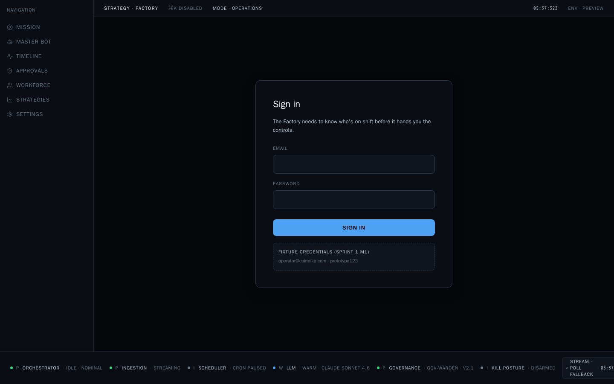

- **Email + password** authenticate against `POST /api/auth/login`.
- A successful login mints a JWT + refresh pair; the shell hydrates via `GET /api/auth/me` and lands you on **Mission Control** (`/c/mission`).
- The session persists across reloads. If the JWT expires mid-session the `apiClient` refresh flow triggers transparently; if refresh also fails, a `sf-auth-unauthorized` event returns you to sign-in with the last surface remembered.

> **In v1.3.0 the sign-up flow is intentionally not exposed on the UI.** Operator accounts are seeded (see [`test_credentials.md`](test_credentials.md) or [Appendix C](#appendix-c--fixture-credentials)). Additional users are managed via `Settings → Users` (admin only).

---

## 3 · Mission Control · `/c/mission`

Mission Control is **the surface you land on**. It answers six operator questions in one glance, without scrolling past the fold on a 1440×900 workstation.

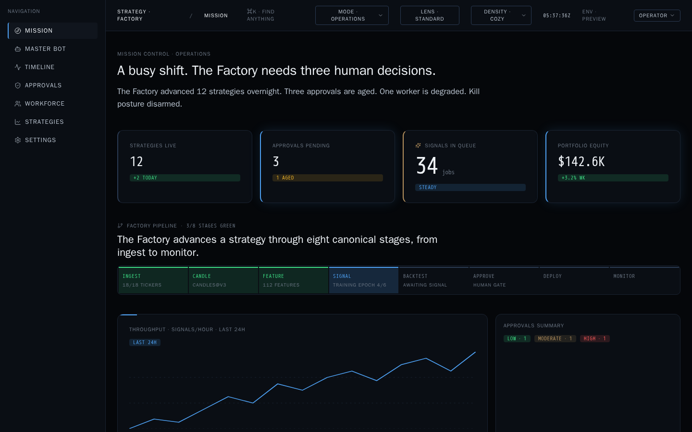

### Anatomy

| Zone | What it tells you |
|---|---|
| **Headline** (top) | Mode-scoped one-liner. Operations mode: "A busy shift. The Factory needs three human decisions." |
| **Briefing** | Two-sentence prose summary of the last shift and the current posture. |
| **4-metric strip** | `STRATEGIES LIVE` · `APPROVALS PENDING` · `SIGNALS IN QUEUE` · `PORTFOLIO EQUITY` (**Portfolio Equity restored in Sprint 2 R1**). Each block carries a tone chip (steady / +2 today / 1 aged / etc.). |
| **Factory pipeline** | The eight canonical stages — `INGEST → CANDLE → FEATURE → SIGNAL → BACKTEST → APPROVE → DEPLOY → MONITOR`. Green = passing, blue = active, muted = idle, orange = attention. |
| **Throughput chart** | Signals/hour over the last 24 h. |
| **Approvals summary** | Risk-tier counts (LOW / MODERATE / HIGH) with click-through to `/c/approvals`. |
| **Activity feed** | Rolling ActivityRows of the most recent Factory events, colour-coded by actor. |

### Sub-modes

The **MODE** toggle in the top bar swaps the headline + briefing + emphasis across four operator personas, without changing the underlying data:

| Mode | Emphasis |
|---|---|
| **OPERATIONS** *(default)* | Approvals aged · workers degraded · kill posture. |
| **EXECUTIVE** | AUM Δ · guardrail health · flagship strategy status. |
| **RESEARCH** | Plan progress · backtests completed · LLM proposal queue. |
| **DEVELOPER** | Service posture · worker state · error counts. |

Mode is remembered per-user and per-session; the last selection persists into the URL query for shareability.

---

## 4 · Master Bot · `/c/masterbot`

*Introduced Sprint 2 · N2.* The Master Bot is the overseer that orchestrates the Factory. Its **stance, budget, current plan, and last decisions** live here.

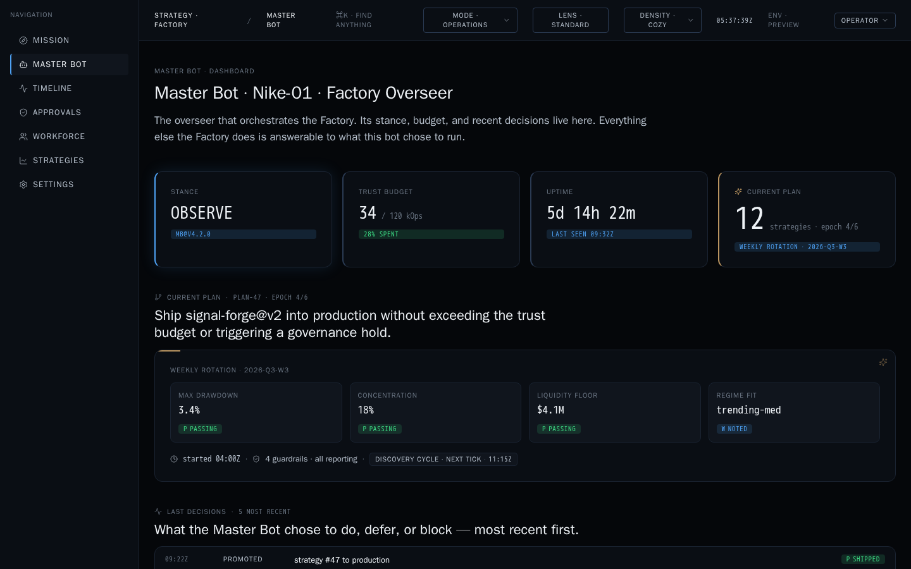

### Anatomy

1. **Identity strip** — codename (`Nike-01`), role (`Factory Overseer`), version (`MB0V4.2.0`), stance chip (`OBSERVE` / `ADVISE` / `ACT`), trust budget (`34 / 120 kOps · 28% spent`), uptime (`5d 14h 22m`).
2. **Current plan card** — plan id (`plan-47 · epoch 4/6`), ambition ("Ship `signal-forge@v2` into production without exceeding the trust budget…"), the four guardrails (`Max Drawdown` · `Concentration` · `Liquidity Floor` · `Regime Fit`) each with pass/fail chips, and the **discovery cycle next-tick postmark** (`next tick · 11:15Z` · **added Sprint 2 R2**).
3. **Last decisions log** — ranked feed of the five most recent Master Bot decisions, most recent first (`PROMOTED strategy #47 to production` / `HELD strat-014 pending schema attest` / …).

### Adapter posture

`masterBotAdapter.js` currently binds to a **fixture bundle** under the Backend Feature Freeze. When `/api/master-bot/*` lands on the Backend Activation Roadmap the surface will pivot to live traffic **with zero surface-side change** (the adapter contract is stable).

### Stance meaning

| Stance | Backend behaviour today | Operator implication |
|---|---|---|
| **OBSERVE** *(current)* | Master Bot reads timeline + strategies, does not emit ApprovalCards autonomously. | You drive proposals via ⌘K. |
| **ADVISE** | Master Bot drops ApprovalCards ranked by ambition score; still human-gated. | You skim + approve. |
| **ACT** | Master Bot self-approves within trust-budget bounds. | Reserved; not permitted until Sprint 4. |

---

## 5 · Timeline · `/c/timeline`

Every action by every actor — in one chronological stream. The **audit trail** for the Factory.

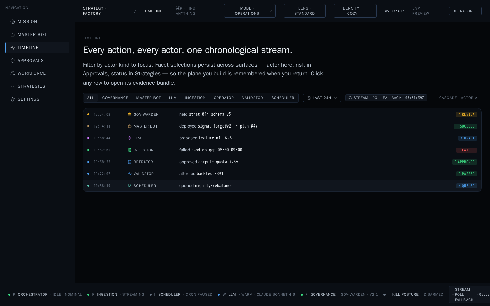

### Anatomy

- **Actor filter row** — `ALL` · `GOVERNANCE` · `MASTER BOT` · `LLM` · `INGESTION` · `OPERATOR` · `VALIDATOR` · `SCHEDULER`. Facet selections persist across surfaces (see [§12 Density/Lens/Mode](#12--mode--lens--density-personalization)).
- **Time window** — `LAST 24H` (default) · `LAST 1H` · `LAST 7D` · `LAST 30D`.
- **Stream postmark** — `STREAM · POLL FALLBACK · 05:36:18Z`. Live tick counter proves streaming is progressing. WSS is attempted first; if it fails or the token expires, the surface transparently falls back to a 5-second poll (Sprint 2 N3).
- **Row structure** — `time` · `actor icon + label` · `verb + object` · `status chip`.

### What each row means

| Verb | Actor | Interpretation |
|---|---|---|
| `held` | `GOV-WARDEN` | Governance blocked a promotion pending schema attest. |
| `deployed` | `MASTER BOT` | Master Bot advanced a plan step (`plan #47 → epoch 4/6`). |
| `proposed` | `LLM` | Strategy proposal generated; sits in Approvals as a draft. |
| `failed` | `INGESTION` | A candle-gap or provider outage. Auto-retry queued. |
| `approved` | `OPERATOR` | You approved (e.g. `compute quota +25%`). |
| `attested` | `VALIDATOR` | Backtest signature verified; evidence bundle sealed. |
| `queued` | `SCHEDULER` | A cron job (e.g. `nightly-rebalance`) enrolled. |

Click any row to open its **evidence bundle** in a right-side drawer.

---

## 6 · Approvals · `/c/approvals`

The **human gate**. This is where every governance decision materializes.

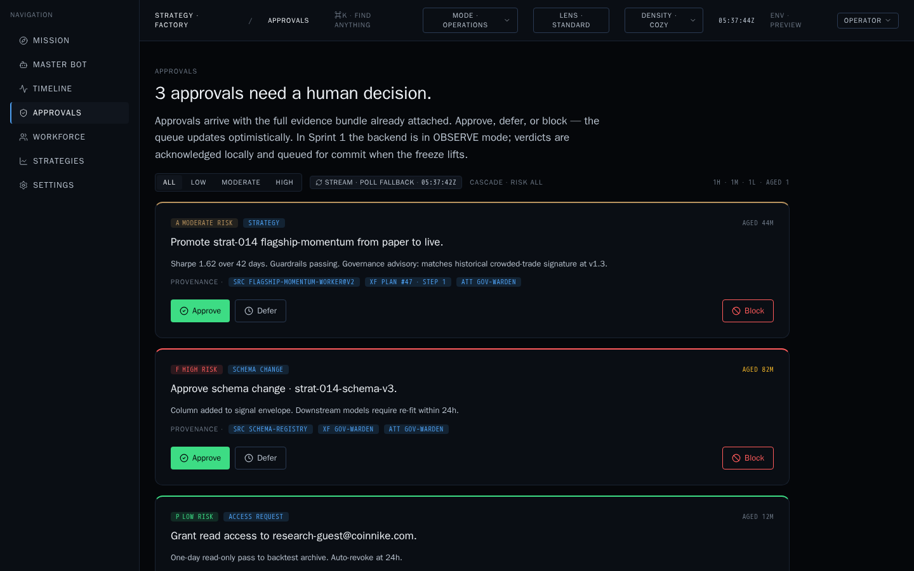

### Anatomy

- **Risk-tier filter** — `ALL` · `LOW` · `MODERATE` · `HIGH`. `AGED · <n>` chip surfaces items that have waited more than the mode-scoped threshold.
- **Stream postmark** — same as Timeline; proves the queue is live.
- **ApprovalCard** — one card per pending decision. Cards render with the full **evidence bundle already attached**:
  - **Risk chip** + **subject chip** (`STRATEGY`, `SCHEMA CHANGE`, `ACCESS REQUEST`, …).
  - **Headline** — one-sentence intent (`Promote strat-014 flagship-momentum from paper to live.`).
  - **Body** — evidence prose (`Sharpe 1.62 over 42 days. Guardrails passing. Governance advisory: matches historical crowded-trade signature at v1.3.`).
  - **Provenance triple** — `SRC · flagship-momentum-worker@v2` · `XF · plan #47 · step 1` · `ATT · gov-warden`. Traces the decision back to its origin, transform, and attester.
  - **Action row** — `Approve` (green) · `Defer` (neutral) · `Block` (red).
  - **Age chip** — `AGED 44m`.

### Approve · Defer · Block semantics

Under the current Backend Feature Freeze (`v1.1.0-stage4`), verdicts are **acknowledged locally and queued for commit** when the freeze lifts. In OBSERVE mode this is intentional — a preview build proves the workflow without mutating production ledgers. See [§15 Freeze posture](#15--freeze-posture--backend-advisory-mode).

| Verb | Effect (freeze-on) | Effect (freeze-off, Sprint 3+) |
|---|---|---|
| **Approve** | Card removed from queue; local ledger entry stored. | `POST /api/approvals/{id}/approve` — triggers the underlying endpoint (e.g. `POST /api/strategies` for a proposal). |
| **Defer** | Card pushed to bottom with `DEFERRED` chip; re-surfaces after mode-scoped SLA. | Same. |
| **Block** | Card removed; `BLOCKED` chip written; governance timeline entry. | `POST /api/approvals/{id}/block` — hard-blocks the underlying action. |

### Optimistic queue behaviour

The queue updates optimistically on click. If the backing endpoint later returns a non-success, an `sf-approval-rollback` toast reverts the row and preserves your position.

---

## 7 · Workforce · `/c/workforce`

Every worker/adapter, its state, and what it's working on right now.

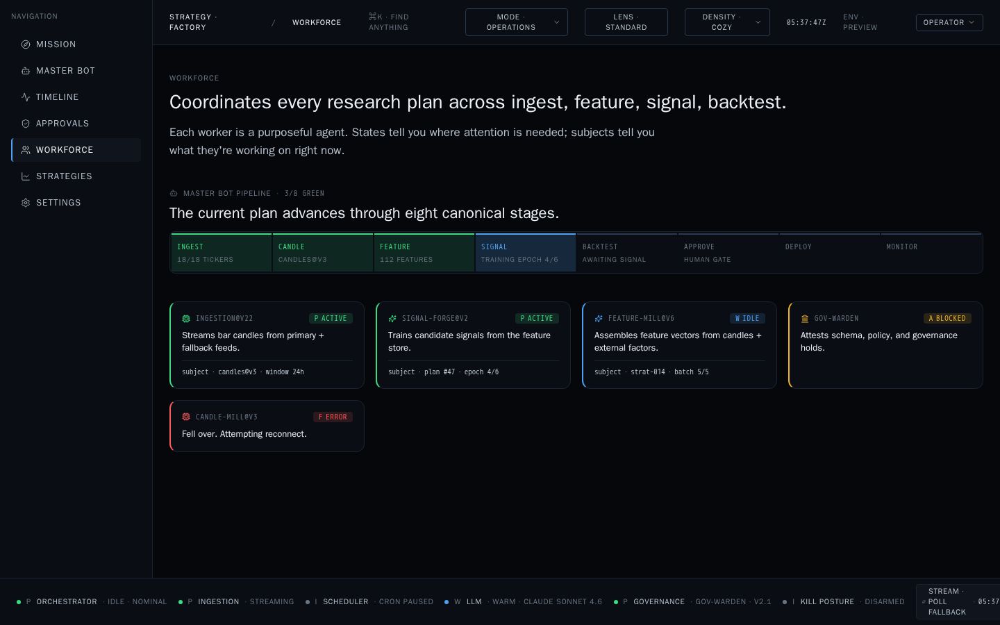

### Anatomy

- **Pipeline mini-strip** — the same 8-stage pipeline from Mission Control, but scoped to the **current Master Bot plan** so you can see which stage each worker feeds.
- **Worker grid** — one tile per worker. Each tile carries:
  - **Codename + version** (`SIGNAL-FORGE@v2`).
  - **State chip** — `P ACTIVE` · `W IDLE` · `A BLOCKED` · `F ERROR`.
  - **Prose intent** — one sentence describing what the worker exists to do.
  - **Subject line** — what it's operating on right now (`subject · plan #47 · epoch 4/6`).

### Reading worker states

| Chip | Meaning | Operator action |
|---|---|---|
| **P ACTIVE** (green) | Streaming / running. Progress in `subject`. | Nothing — leave it. |
| **W IDLE** (blue) | Warm, no current subject. | Nothing — it's on standby. |
| **A BLOCKED** (yellow) | Waiting on an external gate (schema, governance hold, quota). | Check Approvals — often there is an evidence card. |
| **F ERROR** (red) | Fell over. Auto-reconnect in progress. | Check the tile prose; if persistent, escalate via Approvals `Block worker restart`. |

### Sprint 2 semantic additions

The worker grid received `role=list` and `aria-label` metadata for screen readers (N2 · N4). No visual change.

---

## 8 · Strategies · `/c/strategies`

**Every strategy. One table. Click through to a full passport.**

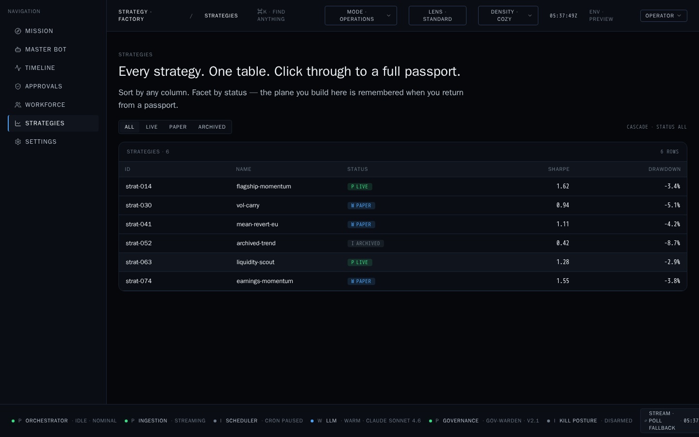

### Anatomy

- **Status filter** — `ALL` · `LIVE` · `PAPER` · `ARCHIVED`. Persists.
- **Table columns** — `ID` · `NAME` · `STATUS` · `SHARPE` · `DRAWDOWN`. Every column is sortable.
- **Status chips** — `P LIVE` · `W PAPER` · `I ARCHIVED`. Colour follows the shell's tone palette (Design Freeze §2.3).
- **Row click** → **Strategy Passport** (`/c/strategies/:id`).

### Adapter posture

`factoryAdapter.fetchStrategies()` is **LIVE**. It calls `GET /api/strategies` and renders whatever the backend returns. If the endpoint 401s the shell re-auths transparently. If it 5xx's the surface renders `mc-partial-notice` and falls back to the fixture bundle (Sprint 2 N4).

---

## 9 · Strategy Passport · `/c/strategies/:id`

*Introduced Sprint 2 · N5.* One page that tells the full story of a single strategy — signature, identity, evidence, guardrails, equity curve, backtest attestation, approval history.

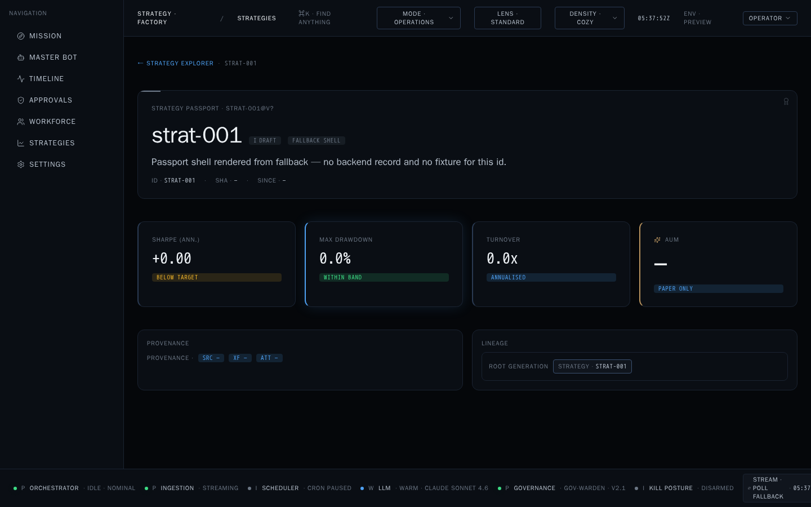

### Anatomy (seven sections)

| § | Section | What lives here |
|---|---|---|
| **§1** | Signature header | `SignatureFrame` (gold accent) · name + version + status chip + ambition (one-sentence intent). |
| **§2** | Identity strip | Four metrics — `Sharpe (ann.)` · `Max Drawdown` · `Turnover` · `AUM`. Each with a tone chip (`BELOW TARGET` · `WITHIN BAND` · `ANNUALISED` · `PAPER ONLY`). |
| **§3** | Evidence stack | `ProvenanceTriple` (SRC / XF / ATT) + `LineageBar` (root generation → descendants). |
| **§4** | Guardrails | Grid of guardrail cells — `Max DD` · `Concentration` · `Liquidity Floor` · `Regime Fit` — each with pass/fail chips. |
| **§5** | Equity curve | `ChartTile` (gold accent) — daily/weekly/monthly PnL curve, hover for tooltips. |
| **§6** | Backtest attestation | Signed evidence card — `backtest-891 · attested by validator · sha …`. |
| **§7** | Approval history | Chronological list — every gate this strategy has passed (or been blocked at). |

### Fallback behaviour

If the strategy id in the URL is unknown to both the live backend and the fixture bundle, the surface renders a **documented fallback shell** — labelled `FALLBACK SHELL`, `DRAFT` chip, "Passport shell rendered from fallback — no backend record and no fixture for this id." — with all seven sections structurally intact but populated with em-dash placeholders. This proves route stability under any data condition (Sprint 2 N5 exit gate).

### How to reach a passport

- **Click a row** in `/c/strategies` (primary path).
- **⌘K** → type strategy name → the palette resolves to the passport route.
- **Direct URL** — `/c/strategies/strat-014`.

---

## 10 · Settings · `/c/settings`

Personalization, providers, users. Under the Backend Feature Freeze the surface is intentionally scaffold-only; the full user/provider grid ships with Sprint 3.

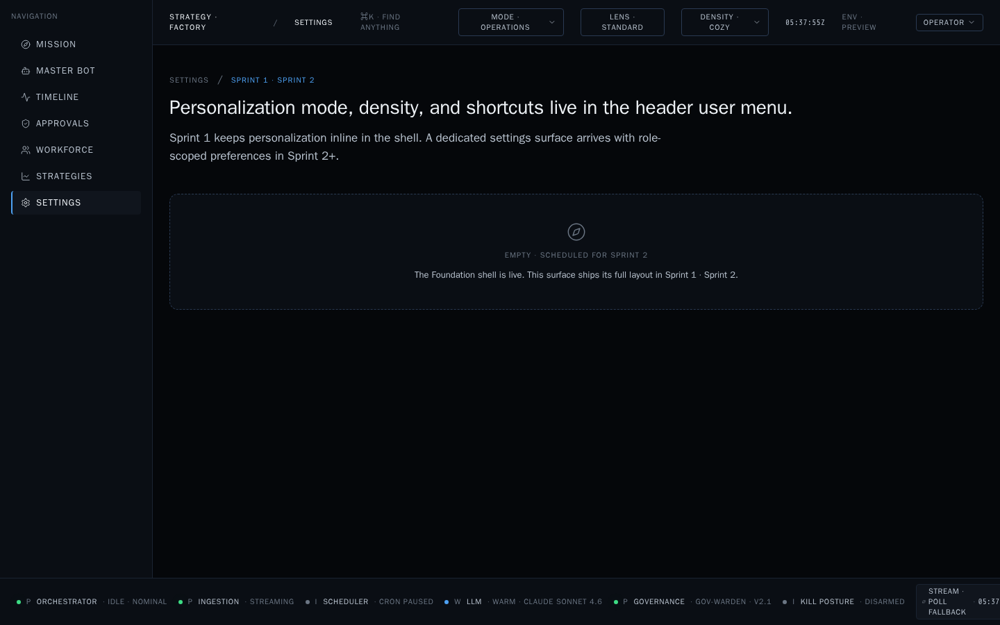

### What lives here in v1.3.0

- **Personalization** — mode, lens, density selectors (also reachable from the top bar; this is the persistent home).
- **Providers → Probe** — *admin only, hidden under `ADVISORY` role gate.* Calls `POST /api/admin/providers/probe`.
- **Users** — *admin only.* CRUD for operator accounts (create, approve, revoke, delete). See [`SPRINT_2_OPERATOR_CAPABILITY_COVERAGE_REPORT.md`](SPRINT_2_OPERATOR_CAPABILITY_COVERAGE_REPORT.md) §2 rows 24–29.

Non-admin operators see the **"EMPTY · SCHEDULED FOR SPRINT 2"** state template — this is Design Freeze §1.4 explicit affordance for scoped empties. Everything you personalize about the shell is still available inline in the top bar (Mode · Lens · Density) or from the user menu.

---

## 11 · The `⌘K` command palette

**One shortcut. Every action.**

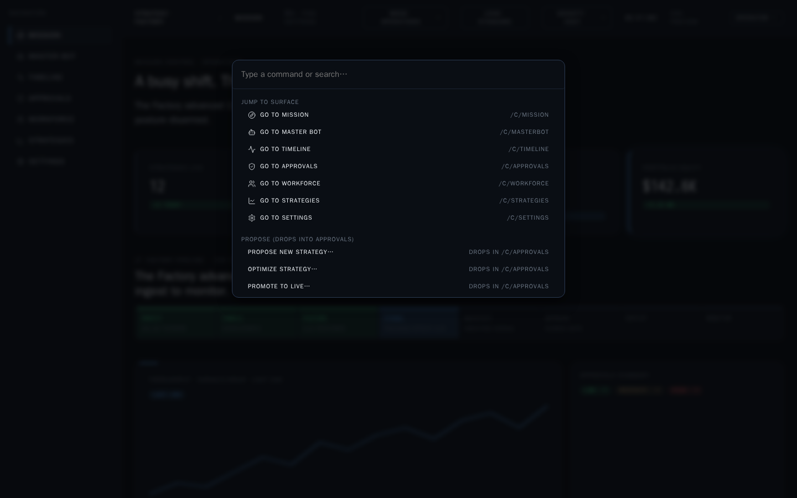

### Open with

- **Cmd-K** (macOS) · **Ctrl-K** (Linux / Windows).
- Or click the `⌘K · FIND ANYTHING` chip in the top bar.

### Categories in the palette

| Category | Entries (Sprint 2) | Behaviour |
|---|---|---|
| **JUMP TO SURFACE** | `Go to Mission` · `Go to Master Bot` · `Go to Timeline` · `Go to Approvals` · `Go to Workforce` · `Go to Strategies` · `Go to Settings` | Direct navigation. |
| **PROPOSE (drops into Approvals)** *· R3 · new in Sprint 2* | `Propose new strategy…` · `Optimize strategy…` · `Promote to live…` | Drops an ApprovalCard into `/c/approvals`. Never mutates directly. |
| **ADVANCED LENS · RESEARCH MODE** *(Advanced Lens only)* | `Open champions catalogue…` · `Ask research question…` · `Recent research queries…` | Surfaces `/api/knowledge/*` + `/api/research/*` endpoints. |
| **SESSION** | `Sign out` | Terminates the JWT and returns to AuthGate. |

### Design principle · "Decisions before actions"

The palette **never emits a mutating call directly**. Every operator-initiated action drops an ApprovalCard that must then be approved on `/c/approvals`. This is intentional: the Governance layer (`GOV-WARDEN`) sees every proposal before it becomes a write.

### Focus trap & accessibility

The palette focus-traps (Sprint 2 N4) — `Tab` cycles within the palette, `Esc` closes, `Enter` commits. Every entry has a `data-testid` (`cmdk-item-*`) for automation.

---

## 12 · Mode · Lens · Density (personalization)

The shell adapts to **who is working, what they're looking at, and how dense they want it**. All three selectors live in the top bar and in the user menu.

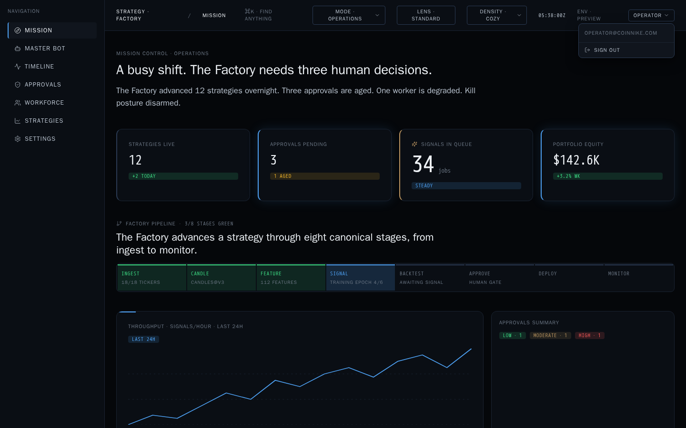

| Selector | Values | Scope |
|---|---|---|
| **MODE** | `OPERATIONS` · `EXECUTIVE` · `RESEARCH` · `DEVELOPER` | Rewrites headlines, briefings, and emphasis across every surface (headline copy is mode-scoped). |
| **LENS** | `STANDARD` · `ADVANCED` | Unlocks power-user affordances — research-mode palette entries, provenance drilldowns, knowledge-graph tooltips. Standard is the safe default. |
| **DENSITY** | `COZY` · `COMPACT` | Row height, padding, and font-size scale. Compact reveals ~30 % more rows on Mission Control activity feed and Timeline. |

Selection is persisted to the user's workspace-state store (client-side; sync to `/api/admin/users/{id}` preferences lands with Sprint 3). Mode + lens are also encoded in every surface's URL query (`?mode=research&lens=advanced`) for shareable links.

---

## 13 · The Status Rail & streaming affordances

The bottom bar always tells you the six health chips of the Factory.

```
● ORCHESTRATOR · IDLE · NOMINAL     ● INGESTION · STREAMING     ● LLM · WARM · CLAUDE SONNET 4.6
● SCHEDULER · CRON PAUSED           ● GOVERNANCE · GOV-WARDEN · V2.1
● KILL POSTURE · DISARMED           STREAM · POLL FALLBACK · 05:37:42Z
```

### The six chips

| Chip | Values | What to do |
|---|---|---|
| **ORCHESTRATOR** | `IDLE · NOMINAL` · `RUNNING` · `DEGRADED` | Degraded → check Workforce for the failing worker. |
| **INGESTION** | `STREAMING` · `LAGGED` · `STALLED` | Stalled → open Timeline, filter `INGESTION`. |
| **LLM** | `WARM · <model>` · `COLD` · `RATE-LIMITED` | Rate-limited → LLM proposals will queue. |
| **SCHEDULER** | `CRON PAUSED` (dev) · `CRON ACTIVE` (prod) · `DEGRADED` | Preview builds run `PAUSED` intentionally. |
| **GOVERNANCE** | `GOV-WARDEN · <version>` · `HELD` · `DISABLED` | Held → an ApprovalCard is waiting on you. |
| **KILL POSTURE** | `DISARMED` · `ARMED` · `ENGAGED` | See [§16 Emergency posture](#16--emergency-posture). |

### Stream postmark

`STREAM · POLL FALLBACK · <UTC>` — the tick counter increments on every keepalive frame (WSS) or poll response (fallback). It is your proof that the surface is live. A stale counter (>15 s without change) is the earliest signal that the streaming layer is degraded. Same postmark appears on Timeline and Approvals so you can eyeball freshness without leaving the surface (Sprint 2 N3).

---

## 14 · Workflows an operator will actually run

The next sections walk through the five workflows that make up 95 % of a real shift.

### 14.1 Morning routine (5 minutes)

1. Open the URL → sign in → land on `/c/mission`.
2. Read the **headline + briefing**. If it says "Nothing needs you." → close the tab, go get coffee.
3. If it says "Three human decisions." → click the `APPROVALS PENDING · 3 · 1 AGED` metric block or `⌘K → Go to Approvals`.
4. Work the aged card first, then HIGH → MODERATE → LOW.

### 14.2 Proposing a new strategy

1. `⌘K` → `Propose new strategy…`.
2. Fill the CNL (Compressed Natural Language) prompt in the sheet — `hypothesis` · `market` · `regime` · `budget`.
3. Submit. A `DRAFT` ApprovalCard drops into `/c/approvals` tagged `LLM` and `MODERATE`.
4. When the LLM finishes generating the strategy, the card auto-promotes to `PROPOSED`. You approve.
5. On approval, `POST /api/strategies` is called; the strategy appears in `/c/strategies` with status `PAPER`.
6. Track it via its **Strategy Passport**.

### 14.3 Promoting paper → live

1. Open the strategy's passport (`/c/strategies/strat-014`).
2. Read §4 Guardrails. All four must be `PASSING`.
3. Read §5 Equity curve. Trailing 30-day slope > 0.
4. Read §6 Backtest attestation. Must be `attested by validator`.
5. `⌘K` → `Promote to live…` → select the strategy → submit.
6. A HIGH-risk ApprovalCard drops into `/c/approvals`. **This one you cannot self-approve** if the strategy is >$100k AUM — governance requires a second gate.

### 14.4 Investigating a worker error

1. `KILL POSTURE` chip goes yellow, or a worker tile shows `F ERROR`.
2. `⌘K → Go to Workforce`. Read the tile prose ("Fell over. Attempting reconnect.").
3. `⌘K → Go to Timeline`, filter actor = `INGESTION` (or whichever), read last 5 rows.
4. If the worker recovered (`P ACTIVE` again) → done.
5. If persistent → `⌘K → Propose worker restart…` → drops an ApprovalCard in the `SCHEMA CHANGE` tier.

### 14.5 End-of-shift audit

1. `⌘K → Go to Timeline`, filter `LAST 24H`, actor = `ALL`.
2. Skim for red rows (`F FAILED`). Every failed row must have a downstream `P PASSED` or `A REVIEW` chip — otherwise it's orphaned and needs an Approval.
3. `⌘K → Go to Master Bot`. Verify the plan card postmark advanced during your shift (`next tick · <fresh UTC>`).
4. `⌘K → Sign out`.

---

## 15 · Freeze posture & backend advisory mode

**Backend Feature Freeze `v1.1.0-stage4`** is in effect for the v1.3.0 release. This is a deliberate posture, not a bug.

| Layer | Rule | What it means for you |
|---|---|---|
| **Backend source** | No commits under `/app/backend/` since `v1.1.0-stage4`. | Endpoint set is fixed at 29 (see [`SPRINT_2_OPERATOR_CAPABILITY_COVERAGE_REPORT.md`](SPRINT_2_OPERATOR_CAPABILITY_COVERAGE_REPORT.md) §2). |
| **Design tokens** | `tokens.css`, typography, spacing untouched since Sprint 1 M1. | Every surface in this manual will render identically on production. |
| **Adapter boundary** | New endpoints go through `/os/adapters/` with fixture fallback. | If backend degrades, surfaces render the fixture snapshot rather than a blank page. |
| **Approval side-effects** | Verdicts (Approve · Block) are **acknowledged locally** and queued for commit when the freeze lifts (Sprint 3). | The queue empties on click; the backend does not yet mutate. Timeline still receives the local `OPERATOR · approved …` event. |

**Three surfaces run on fixture** under the freeze (masterBotAdapter, strategyPassport lineage, streamAdapter poll payload). These are documented deliberate artefacts, not omissions — see the coverage report §4 "Freeze artefacts".

---

## 16 · Emergency posture

If something is on fire.

### 16.1 Kill Posture

The `KILL POSTURE` chip in the StatusRail is the master switch.

| State | Meaning | Who can flip it |
|---|---|---|
| **DISARMED** *(default)* | Factory operates normally. | — |
| **ARMED** | Autonomous actions blocked; all workers dropped to `W IDLE`. Human approvals still flow. | Operator via `⌘K → Arm kill posture…` (HIGH ApprovalCard). |
| **ENGAGED** | Full stop. Ingestion continues (data preservation), everything else halted. Only Sign-out and Kill-disengage actions are enabled. | Operator with `admin` role. |

### 16.2 Global emergency banner

If the shell detects that a critical service (Governance, Ingestion, or the shell's own auth) is unavailable, an **EmergencyBanner** renders across the top of every surface, tone-coded red, with a single actionable link ("Check `/c/timeline` for the last confirmed heartbeat"). The banner is dismissible per session; it re-arms on next surface change.

### 16.3 Recovery order

1. Read the banner.
2. `⌘K → Go to Timeline`, filter to the affected actor, read the last two rows.
3. If Ingestion → confirm provider health via `Settings → Providers → Probe` (admin).
4. If Governance → contact the on-call — the manual will not tell you to hotfix Governance.
5. If Auth → sign out, sign back in. The 401 interceptor should have already tried a refresh.

---

## 17 · Troubleshooting

| Symptom | Likely cause | First step |
|---|---|---|
| **Blank surface** | Adapter fetch failed and no fixture. | Reload. Check `STREAM` postmark; if stale, ingestion is degraded. |
| **`FALLBACK SHELL` chip on a Strategy Passport** | Unknown strategy id in URL. | Return to `/c/strategies` and click a real row. |
| **`AUTHENTICATION EXPIRED` toast** | JWT rotation failed. | Sign out, sign back in. `test_credentials.md` has fixtures for preview. |
| **`⌘K` won't open** | Focus is trapped inside a modal — check for an open evidence drawer. | Press `Esc` first. |
| **`STREAM · POLL FALLBACK` never advances (>30 s)** | Streaming layer down; poll also failing. | Check network; then `Settings → Providers → Probe` (admin). |
| **Approvals queue re-populates a card I approved** | Optimistic verdict was reverted server-side. | Read the `sf-approval-rollback` toast; the card will be back with an updated risk tier. |
| **Mission Control shows `mc-partial-notice`** | One aggregator source failed; `Promise.allSettled` rendered the rest. | Non-blocking. The banner tells you which source. |
| **New surface I've never seen** | Sprint 3 preview flag flipped. | Return to `/c/mission`. If it persists, this manual is stale. |

---

## Appendix A · Route inventory

| Path | Surface | Auth | First delivered |
|---|---|:-:|:-:|
| `/` | AuthGate | none | v1.0 |
| `/c/mission` | Mission Control | JWT | Sprint 1 |
| `/c/masterbot` | Master Bot Dashboard | JWT | **Sprint 2 N2** |
| `/c/timeline` | Timeline | JWT | Sprint 1 |
| `/c/approvals` | Approvals | JWT | Sprint 1 |
| `/c/workforce` | Workforce | JWT | Sprint 1 |
| `/c/strategies` | Strategies Explorer | JWT | Sprint 1 |
| `/c/strategies/:id` | Strategy Passport | JWT | **Sprint 2 N5** |
| `/c/settings` | Settings | JWT + role-scoped | Sprint 1 (scaffold) |

The catch-all splat route (Sprint 2 N4) returns any unknown path to `/c/mission` after a 300 ms grace, preserving the last known query.

---

## Appendix B · Data-testid map for QA / automation

Every interactive element in Sprint 2 carries a `data-testid`. The `scripts/check-testids.js` CI gate blocks any commit that regresses coverage. The canonical prefixes are:

| Prefix | Owner |
|---|---|
| `nav-*` | Left Rail entries (`nav-mission`, `nav-masterbot`, …) |
| `cmdk-*` | Command palette (`cmdk-trigger`, `cmdk-item-<slug>`) |
| `mode-*` · `lens-*` · `density-*` | Top-bar selectors |
| `metric-*` | Mission Control 4-strip (`metric-strategies-live`, `metric-approvals-pending`, `metric-signals-in-queue`, `metric-portfolio-equity`) |
| `pipeline-stage-*` | 8-stage pipeline cells |
| `activity-row-*` | Mission Control feed |
| `timeline-row-*` | Timeline rows |
| `approval-card-*` | ApprovalCard root |
| `approve-btn-*` · `defer-btn-*` · `block-btn-*` | Approval actions |
| `worker-tile-*` | Workforce tiles |
| `strategy-row-*` | Strategies table rows |
| `passport-section-*` | Strategy Passport sections `1..7` |
| `status-chip-*` | StatusRail chips |
| `stream-postmark-*` | Streaming tick counters |
| `user-menu-*` | User menu / sign-out |
| `emergency-banner-*` | Emergency posture |

For the complete list run `yarn test:testids` locally.

---

## Appendix C · Fixture credentials

The preview build seeds two operator fixtures (Sprint 1 M1). These are safe to share; they only exist in preview / demo builds.

| Role | Email | Password |
|---|---|---|
| **operator** (default) | `operator@coinnike.com` | `prototype123` |
| **admin** (production seed — see [`test_credentials.md`](test_credentials.md)) | `admin@strategyfactory.dev` | *(rotated per environment · see `.env`)* |

The AuthGate prints the operator fixture directly on the sign-in card in preview builds.

---

## Appendix D · Where each Sprint 2 report lives

| Report | File |
|---|---|
| Sprint 2 sign-off packet (canonical) | [`SPRINT_2_SIGN_OFF_PACKET.md`](SPRINT_2_SIGN_OFF_PACKET.md) |
| Operator-facing capability coverage | [`SPRINT_2_OPERATOR_CAPABILITY_COVERAGE_REPORT.md`](SPRINT_2_OPERATOR_CAPABILITY_COVERAGE_REPORT.md) |
| Legacy capability & UX audit | [`SPRINT_2_LEGACY_CAPABILITY_AUDIT.md`](SPRINT_2_LEGACY_CAPABILITY_AUDIT.md) |
| Final validation report | [`SPRINT_2_FINAL_VALIDATION_REPORT.md`](SPRINT_2_FINAL_VALIDATION_REPORT.md) |
| Production candidate report | [`SPRINT_2_PRODUCTION_CANDIDATE_REPORT.md`](SPRINT_2_PRODUCTION_CANDIDATE_REPORT.md) |
| VPS deployment package | [`SPRINT_2_VPS_DEPLOYMENT_PACKAGE.md`](SPRINT_2_VPS_DEPLOYMENT_PACKAGE.md) |
| Phase-1 (v1.1) operator manual (predecessor) | [`../docs/legacy/memory/OPERATOR_MANUAL.md`](../docs/legacy/memory/OPERATOR_MANUAL.md) |

---

## Revision history

| Version | Date | Change |
|---|---|:-:|
| **1.3.0** | 2026-07-21 | Initial issue for `v1.3.0-sprint2-complete`. Adds Master Bot Dashboard (D4), Strategy Passport (D5), streaming affordances, ⌘K R3 palette entries, R1 Portfolio Equity restoration, R2 next-tick postmark. |
| 1.2.0 | *(never issued as a standalone manual — see the Phase-1 legacy manual for the v1.1 shell)* | — |
| 1.1.0 | 2026-02-15 | Phase-1 canonical shell manual → [`docs/legacy/memory/OPERATOR_MANUAL.md`](../docs/legacy/memory/OPERATOR_MANUAL.md). |

---

**End of Operator Manual · v1.3.0-sprint2-complete.**

*Prepared as part of the Sprint 2 sign-off packet. Safe to attach directly to the annotated Git tag `v1.3.0-sprint2-complete` and to the GitHub Release.*
